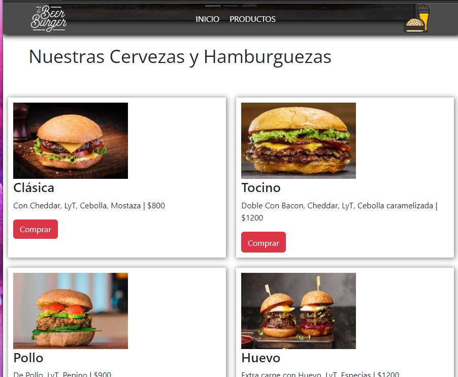
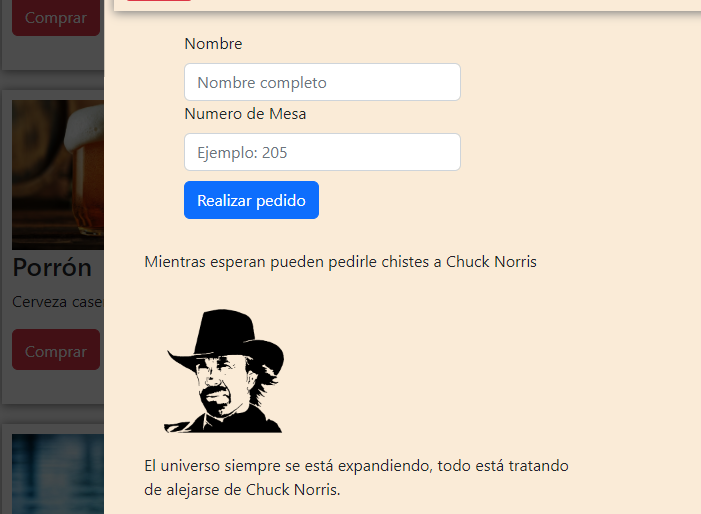

# Entrega Trabajo Final.
---
Objetivo: Desarrollar una app en React.js que comprenda:

* Procesamiento de datos 
* Hooks 
* Consulta a una API 
* Creación de componentes 
* Uso de css en cualquiera de sus variantes. Bootstrap Bootstrap-React o cualquier otro framework. 
* Persistencia local
* Experiencia de usuario en el uso de la aplicación 
* Estructura de archivos y organización del código

# Ideas y enfoque. 
---

El proyecto es una aplicación para un bar de cervezas y hamburguesas, donde el comensal 
pueda realizar el pedido desde la aplicación y le llegue listo a su mesa. Es una página sencilla, y 
fácil de usar desde cualquier dispositivo y tiene toda la información necesaria para encontrar el lugar.

>Se pueden ver los productos fácilmente y realizar el pedido a la mesa.

>Mientras esperan que llegue el pedido pueden desde la aplicación obtener chistes aleatorios de Chuck Norris

Menu:

Chistes:

